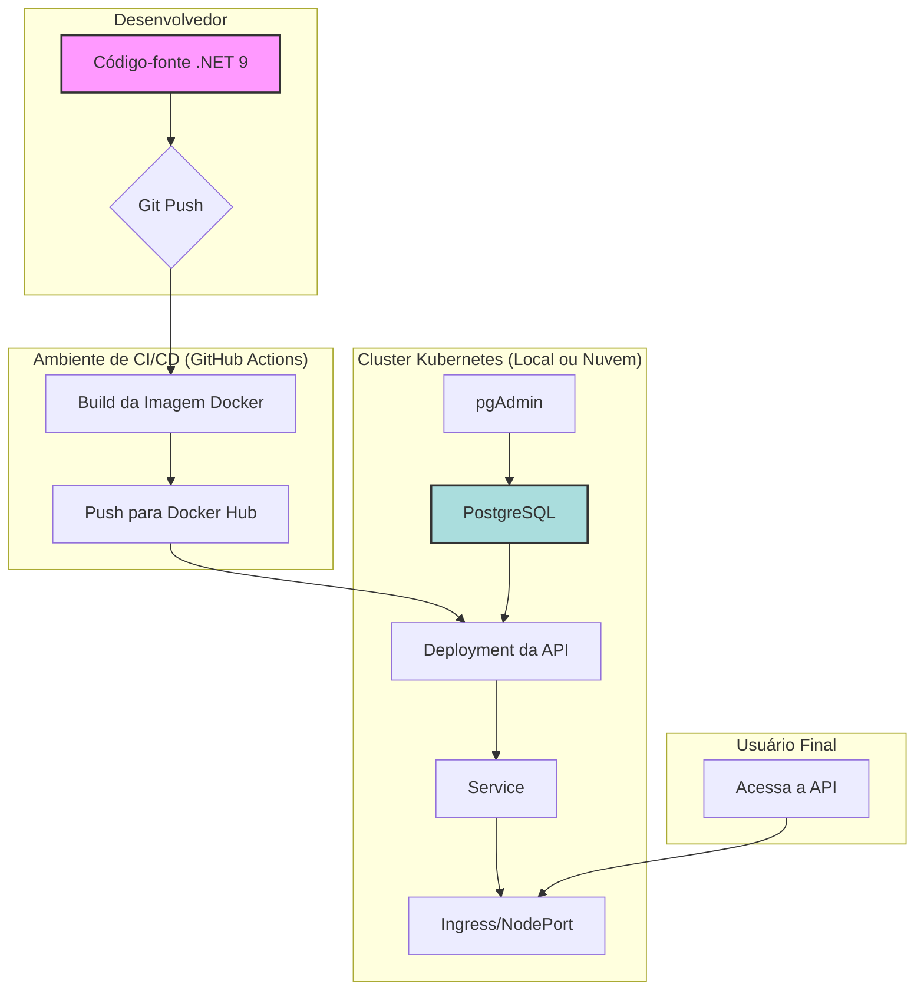

# MecanicaOS: Sistema de Gerenciamento para Oficinas

## 1. Visão Geral e Objetivos

O **MecanicaOS** é uma solução completa para gerenciamento de oficinas mecânicas, projetada para otimizar a rotina de pequenas e médias empresas. O sistema foi desenvolvido como parte do Tech Challenge da Pós-Graduação em Arquitetura de Software, com foco na aplicação de conceitos avançados como **Clean Architecture** e **Domain-Driven Design (DDD)**.

O objetivo desta fase é entregar uma API RESTful robusta, escalável e de fácil manutenção, implantada em um ambiente de contêineres orquestrado com Kubernetes.

### Principais Funcionalidades

*   **Gestão de Clientes e Veículos:** Cadastro e consulta de clientes (Pessoa Física e Jurídica) e seus respectivos veículos.
*   **Controle de Ordens de Serviço (OS):** Criação, acompanhamento de status e registro de insumos.
*   **Gestão de Estoque:** Controle de peças e produtos com alertas de estoque baixo.
*   **Catálogo de Serviços:** Cadastro e consulta dos serviços prestados.
*   **Autenticação e Autorização:** Sistema de login com perfis e controle de acesso baseado em permissões (JWT).

---

## 2. Arquitetura da Solução

A arquitetura foi desenhada para ser desacoplada, resiliente e observável, utilizando contêineres e orquestração para garantir a escalabilidade.

### 2.1. Desenho da Arquitetura

O diagrama abaixo ilustra os componentes da aplicação, a infraestrutura e o fluxo de deploy.



*   **Componentes da Aplicação:**
    *   **API (MecanicaOS):** Container .NET 9.0 que expõe a API RESTful. Segue a Clean Architecture, dividida em camadas de Domínio, Aplicação, Infraestrutura e Apresentação (API).
    *   **Banco de Dados (PostgreSQL):** Container responsável pela persistência dos dados.
    *   **pgAdmin:** Ferramenta de administração para o banco de dados.

*   **Infraestrutura Provisionada:**
    *   **Cluster Kubernetes:** Ambiente de orquestração para os contêineres. Pode ser local (Minikube, Docker Desktop) ou em nuvem (AWS EKS, Google GKE, Azure AKS).
    *   **Deployments:** Gerenciam os Pods da API, do PostgreSQL e do pgAdmin.
    *   **Services:** Expõem os Deployments como serviços de rede dentro do cluster.
    *   **PersistentVolume (PV) e PersistentVolumeClaim (PVC):** Garantem a persistência dos dados do PostgreSQL.
    *   **ConfigMaps e Secrets:** Gerenciam as configurações e segredos da aplicação.
    *   **HorizontalPodAutoscaler (HPA):** Escala automaticamente os Pods da API com base no uso de CPU.

*   **Fluxo de Deploy:**
    1.  O desenvolvedor envia o código para o repositório Git.
    2.  Uma pipeline de CI/CD (ex: GitHub Actions) é acionada.
    3.  A pipeline compila o código, constrói a imagem Docker da aplicação e a envia para um registro (ex: Docker Hub).
    4.  A pipeline se conecta ao cluster Kubernetes e aplica os manifestos do diretório `k8s/`, atualizando a aplicação para a nova versão.

### 2.2. Tecnologias Utilizadas

| Categoria              | Tecnologia                  |
| ---------------------- | --------------------------- |
| **Backend**            | .NET 9.0, ASP.NET Core      |
| **Banco de Dados**     | PostgreSQL                  |
| **ORM**                | Entity Framework Core 9.0   |
| **Testes**             | xUnit, Moq                  |
| **Containerização**    | Docker, Docker Compose      |
| **Orquestração**       | Kubernetes                  |
| **Autenticação**       | JWT (JSON Web Tokens)       |
| **Documentação da API**| Swagger (OpenAPI)           |

---

## 3. Instruções de Execução e Deploy

### 3.1. Execução Local (Docker Compose)

Esta é a forma mais rápida de subir todo o ambiente na sua máquina local.

1.  **Pré-requisitos:**
    *   [Docker Desktop](https://www.docker.com/products/docker-desktop/) ou Docker Engine instalado e em execução.

2.  **Clone o repositório e navegue até a raiz do projeto.**

3.  **Inicie os containers:**
    ```bash
    docker-compose up -d
    ```
    Este comando irá iniciar os containers da API, do banco de dados e do pgAdmin.

4.  **Acesse os serviços:**
    *   **API (Swagger):** `http://localhost:80/swagger`
    *   **pgAdmin:** `http://localhost:5050` (Login: `admin@mecanicaos.com`, Senha: `admin`)

### 3.2. Deploy em Kubernetes (Local)

Siga estes passos para implantar a aplicação em um cluster Kubernetes local (Minikube, Docker Desktop).

1.  **Pré-requisitos:**
    *   Docker em execução.
    *   `kubectl` configurado e apontando para o seu cluster.

2.  **Acesse o diretório dos manifestos:**
    ```bash
    cd k8s
    ```

3.  **Aplique os manifestos:**
    ```bash
    kubectl apply -f .
    ```
    Este comando criará todos os recursos necessários no cluster.

4.  **Verifique os recursos criados:**
    ```bash
    kubectl get pods
    kubectl get services
    kubectl get deployments
    ```
    Aguarde até que todos os Pods estejam com o status `Running`.

5.  **Acesse os serviços:**
    *   **API (Swagger):** `http://localhost:30080/api/v1/docs/index.html`
    *   **pgAdmin:** `http://localhost:30050/`

### 3.3. Provisionamento da Infraestrutura com Terraform

*(Nota: Os scripts do Terraform para provisionamento em nuvem ainda não foram adicionados a este repositório. As instruções abaixo são um guia para quando forem implementados.)*

O provisionamento da infraestrutura em um provedor de nuvem (como AWS, Azure ou GCP) será gerenciado pelo Terraform. Os scripts estarão localizados em um diretório `terraform/` e permitirão a criação de um cluster EKS, banco de dados RDS e outros recursos necessários.

---

## 4. Documentação da API

A documentação completa dos endpoints da API está disponível via Swagger. Após iniciar a aplicação (seja com Docker ou Kubernetes), acesse o link correspondente para explorar e testar os recursos.

*   **Link da Collection (Postman/Swagger):** `[INSIRA O LINK AQUI]`

---

## 5. Vídeo Demonstrativo

Um vídeo demonstrando o ambiente em execução, o fluxo de deploy e as funcionalidades da aplicação está disponível no link abaixo.

*   **Link para o Vídeo (YouTube/Vimeo):** `[INSIRA O LINK AQUI]`
