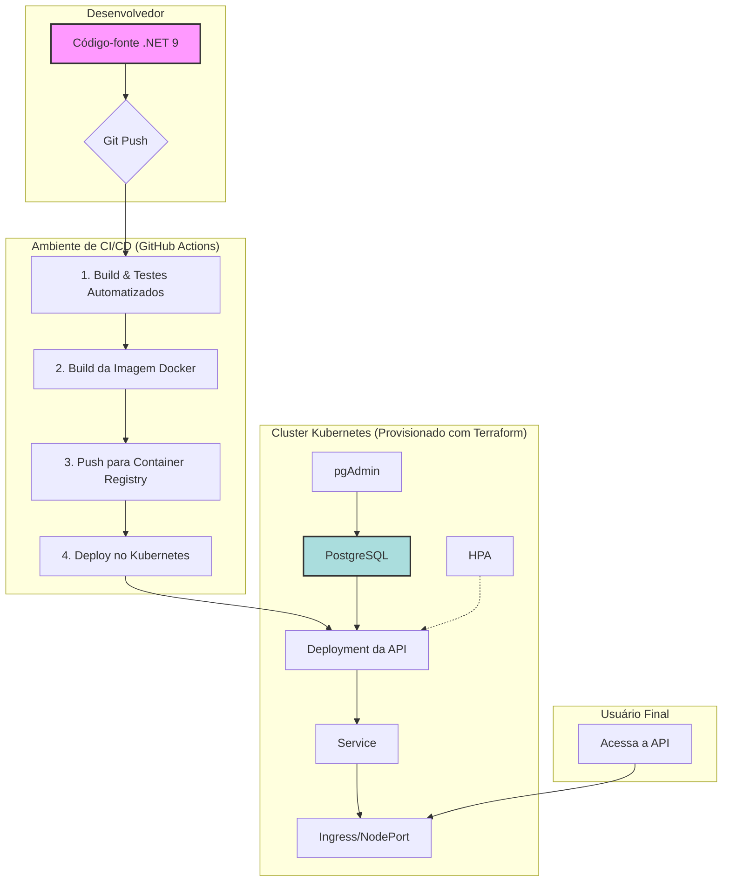

# MecanicaOS: Sistema de Gerenciamento para Oficinas - Fase 2

## 1. Visão Geral e Objetivos

O **MecanicaOS** é uma solução completa para gerenciamento de oficinas mecânicas, projetada para otimizar a rotina de pequenas e médias empresas. O sistema foi desenvolvido como parte do Tech Challenge da Pós-Graduação em Arquitetura de Software.

Nesta segunda fase, o projeto evoluiu para aplicar conceitos avançados de arquitetura de software, infraestrutura como código e automação de CI/CD, resultando em uma API RESTful robusta, escalável e de fácil manutenção, implantada em um ambiente de contêineres orquestrado com Kubernetes.

### Principais Evoluções da Fase 2
- **Refatoração com Clean Architecture:** O código foi reestruturado para seguir os princípios da Clean Architecture, garantindo separação de responsabilidades, baixo acoplamento e alta testabilidade.
- **APIs Especializadas:** Foram criados e alterados endpoints para gerenciar o fluxo de Ordens de Serviço (OS) de ponta a ponta.
- **Infraestrutura como Código (IaC):** A infraestrutura do cluster Kubernetes e do banco de dados é provisionada com Terraform.
- **CI/CD Automatizado:** O pipeline de integração e entrega contínua automatiza o build, testes, publicação de imagem Docker e deploy no Kubernetes.
- **Escalabilidade Automática:** O ambiente está configurado com Horizontal Pod Autoscaler (HPA) para escalar conforme a demanda.

---

## 2. Arquitetura da Solução

A arquitetura foi desenhada para ser desacoplada, resiliente e observável, utilizando contêineres, orquestração e IaC para garantir a escalabilidade e a repetibilidade do ambiente.

### 2.1. Desenho da Arquitetura

O diagrama abaixo ilustra os componentes da aplicação, a infraestrutura provisionada e o fluxo de deploy.



- **Componentes da Aplicação:**
    - **API (MecanicaOS):** Container .NET 9.0 que expõe a API RESTful. Segue a Clean Architecture, dividida em camadas de Domínio, Aplicação, Infraestrutura e Apresentação (API).
    - **Banco de Dados (PostgreSQL):** Gerenciado como um serviço, provisionado via Terraform (ex: AWS RDS) ou como um container persistente.

- **Infraestrutura Provisionada (Terraform):**
    - **Cluster Kubernetes:** Ambiente de orquestração para os contêineres (ex: AWS EKS, Google GKE, Azure AKS).
    - **Banco de Dados:** Instância de banco de dados gerenciada.
    - **Recursos de Rede:** VPCs, subnets e configurações de segurança.

- **Fluxo de Deploy (CI/CD):**
    1. O desenvolvedor envia o código para uma *feature branch* no repositório Git.
    2. Uma pipeline de CI (GitHub Actions) é acionada, executando:
        - Build da aplicação.
        - **Execução dos testes automatizados (unitários e integração).**
    3. Se os testes passam, a pipeline constrói a imagem Docker da aplicação.
    4. A imagem é enviada para um registro de contêiner (ex: Docker Hub, AWS ECR).
    5. A pipeline de CD se conecta ao cluster Kubernetes e aplica os manifestos do diretório `k8s/`, atualizando a aplicação para a nova versão.

### 2.2. Tecnologias Utilizadas

| Categoria | Tecnologia |
|---|---|
| **Backend** | .NET 9.0, ASP.NET Core |
| **Arquitetura** | Clean Architecture, DDD |
| **Banco de Dados** | PostgreSQL |
| **ORM** | Entity Framework Core 9.0 |
| **Testes** | xUnit, Moq |
| **Containerização** | Docker, Docker Compose |
| **Orquestração** | Kubernetes |
| **Infra como Código**| Terraform |
| **CI/CD** | GitHub Actions |
| **Autenticação** | JWT (JSON Web Tokens) |
| **Documentação da API**| Swagger (OpenAPI) |

---

## 3. Endpoints da API

A API foi refatorada para focar no gerenciamento de Ordens de Serviço (OS).

| Verbo | Endpoint | Descrição |
|---|---|---|
| **POST** | `/api/v1/ordem-servico` | **Abertura de OS:** Recebe dados do cliente, veículo, serviços e peças. Retorna a ID única da OS. |
| **GET** | `/api/v1/ordem-servico/{id}` | **Consulta de Status:** Retorna a situação atual da OS (`Recebida`, `Diagnóstico`, `Aguardando Aprovação`, `Execução`, `Finalizada`, `Entregue`). |
| **POST** | `/api/v1/ordem-servico/{id}/aprovar` | **Aprovação de Orçamento:** Endpoint para notificação externa de aprovação do orçamento. |
| **POST** | `/api/v1/ordem-servico/{id}/recusar` | **Recusa de Orçamento:** Endpoint para notificação externa de recusa do orçamento. |
| **GET** | `/api/v1/ordem-servico` | **Listagem de OS:** Retorna a lista de OS com ordenação padrão: `Em Execução` > `Aguardando Aprovação` > `Diagnóstico` > `Recebida`. As mais antigas vêm primeiro. OS `Finalizada` e `Entregue` são omitidas. |
| **PUT** | `/api/v1/ordem-servico/{id}/status` | **Atualização de Status:** Altera o status da OS (ex: notificação via e-mail). |

---

## 4. Instruções de Execução e Deploy

### 4.1. Execução Local (Docker Compose)

Ideal para desenvolvimento e testes rápidos.

1. **Pré-requisitos:**
   - [Docker Desktop](https://www.docker.com/products/docker-desktop/) instalado e em execução.

2. **Clone o repositório e navegue até a raiz do projeto.**

3. **Inicie os containers:**
   ```bash
   docker-compose up -d
   ```

4. **Acesse os serviços:**
   - **API (Swagger):** `http://localhost:80/swagger`
   - **pgAdmin:** `http://localhost:5050` (Login: `admin@mecanicaos.com`, Senha: `admin`)

### 4.2. Provisionamento da Infraestrutura com Terraform

Os scripts para provisionar a infraestrutura em nuvem (AWS) estão no diretório `/infra`.

1. **Pré-requisitos:**
   - [Terraform CLI](https://learn.hashicorp.com/tutorials/terraform/install-cli) instalado.
   - Credenciais da AWS configuradas no seu ambiente.

2. **Acesse o diretório do Terraform:**
   ```bash
   cd infra
   ```

3. **Inicialize o Terraform:**
   ```bash
   terraform init
   ```

4. **Planeje e aplique a infraestrutura:**
   ```bash
   terraform plan
   terraform apply
   ```
   Estes comandos criarão o cluster Kubernetes (EKS), o banco de dados (RDS) e os recursos de rede necessários.

### 4.3. Deploy em Kubernetes

Após provisionar a infraestrutura, siga os passos para o deploy da aplicação.

1. **Pré-requisitos:**
   - `kubectl` configurado para apontar para o seu cluster (o Terraform gera o `kubeconfig`).

2. **Acesse o diretório dos manifestos:**
   ```bash
   cd k8s
   ```

3. **Aplique os manifestos:**
   ```bash
   kubectl apply -f .
   ```
   Este comando criará os Deployments, Services, ConfigMaps, Secrets e HPA no cluster.

4. **Acesse os serviços:**
   - A URL da API será exposta por um Load Balancer ou Ingress. Verifique com `kubectl get services`.

---

## 5. Entregáveis

- **Código-fonte:** Refatorado com Clean Architecture.
- **Containerização:** `/Dockerfile` e `/docker-compose.yml`.
- **Manifestos Kubernetes:** No diretório `/k8s`.
- **Scripts de IaC:** No diretório `/infra`.
- **Pipeline CI/CD:** No diretório `/.github/workflows`.

---

## 6. Documentação da API e Vídeo

- **Link para a Collection (Swagger):** A documentação é gerada automaticamente e está disponível no endpoint `/swagger` da API.
- **Link para o Vídeo Demonstrativo:** `[INSIRA O LINK AQUI]`
